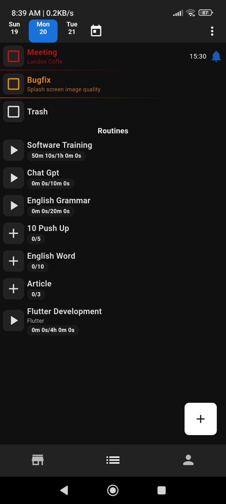
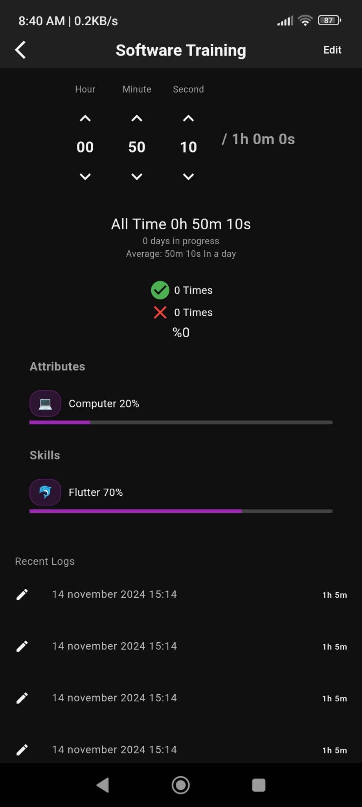
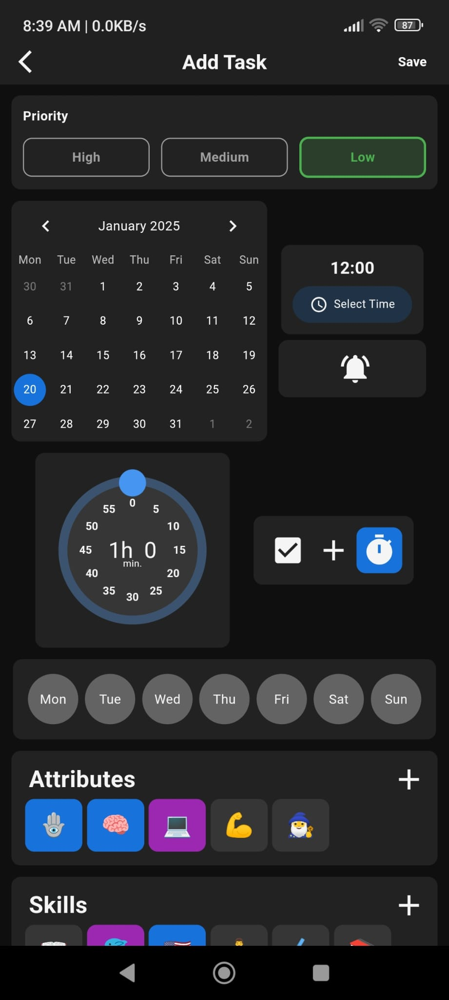
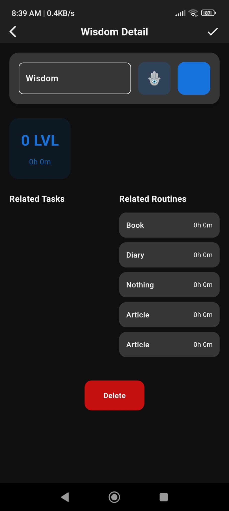
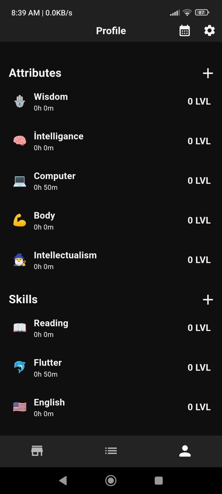
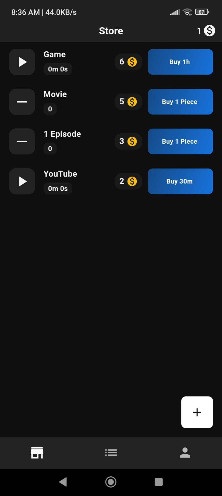

# Gamify Todo Uygulaması

## Genel Bakış
Bu uygulama, kullanıcıların görevlerini yönetmelerine ve bu görevleri tamamladıkça ödüller kazanmalarına olanak tanıyan bir mobil uygulamadır. Temel özellikleri:
- Görev yönetimi
- Rutin takibi
- Ödül mağazası
- Kullanıcı profili
- Temalar ve dil desteği

## Detaylı Açıklama

### Temel İşlevler
1. **Görev Yönetimi**: Kullanıcılar günlük görevler ekleyebilir, düzenleyebilir ve tamamlayabilir.
2. **Rutin Takibi**: Tekrarlayan görevler için rutin oluşturulabilir.
3. **Ödül Sistemi**: Tamamlanan görevler için puan kazanılır ve bu puanlarla mağazadan öğe satın alınabilir.
4. **Profil Yönetimi**: Kullanıcı bilgileri ve istatistikler görüntülenebilir.
5. **Çoklu Dil Desteği**: Uygulama birden fazla dilde kullanılabilir.
6. **Bildirimler**: Görev hatırlatıcıları için bildirim sistemi bulunur.

### Teknik Detaylar

#### Veri Yönetimi
- **Hive**: Yerel veritabanı için Hive kullanılmıştır.
- **Provider**: State yönetimi için Provider pattern kullanılmıştır.
- **Easy Localization**: Çoklu dil desteği için kullanılmıştır.

#### Ana Servisler
1. **HiveService**: Yerel veritabanı işlemlerini yönetir.
   - Metodlar: initHive(), saveData(), getData(), deleteData()
   - Kullanıldığı yerler: Tüm veri erişim noktaları
   - Bağlı widgetlar: TaskList, StorePage, ProfilePage

2. **NotificationService**: Bildirimleri yönetir.
   - Metodlar: showNotification(), scheduleNotification(), cancelNotification()
   - Kullanıldığı yerler: Görev hatırlatıcıları, ödül bildirimleri
   - Bağlı widgetlar: TaskDetailPage, StoreItemDetailPage

3. **ServerManager**: Sunucu iletişimini sağlar.
   - Metodlar: sendRequest(), handleResponse(), syncData()
   - Kullanıldığı yerler: Kullanıcı girişi, veri senkronizasyonu
   - Bağlı widgetlar: LoginPage, SyncButton

4. **GlobalTimer**: Zamanlayıcı işlevleri sağlar. Bu servis:
   - Görevler ve mağaza öğeleri için zamanlayıcı yönetimi yapar
   - Arka planda çalışan periyodik bir timer içerir
   - SharedPreferences ile son durumu kaydeder
   - Bildirim servisi ile entegre çalışır
   - İçerdiği fonksiyonlar:
     - startStopTimer: Timer'ı başlatır/durdurur
     - startStopGlobalTimer: Ana timer kontrolünü sağlar
     - checkSavedTimers: Kayıtlı timer'ları kontrol eder
     - checkActiveTimerPref: Aktif timer bilgilerini yükler
   - Bağlı olduğu widgetlar:
     - TaskDetailPage
     - StoreItemDetailPage
     - HomePage

#### Modeller
1. **TaskModel**: Görev veri yapısını tanımlar.
   - Alanlar: id, title, description, points, status, type, dueDate, createdAt
   - Metodlar: fromJson(), toJson(), copyWith()
   - Bağlı widgetlar: TaskCard, TaskDetailPage, AddTaskPage

2. **RoutineModel**: Rutin veri yapısını tanımlar.
   - Alanlar: id, title, description, days, time, isActive
   - Metodlar: fromJson(), toJson(), toggleActive()
   - Bağlı widgetlar: RoutineCard, RoutineDetailPage

3. **TraitModel**: Kullanıcı özelliklerini tanımlar.
   - Alanlar: id, name, description, level, progress
   - Metodlar: fromJson(), toJson(), addProgress()
   - Bağlı widgetlar: TraitCard, TraitDetailPage

4. **ItemModel**: Mağaza öğelerini tanımlar.
   - Alanlar: id, name, description, price, imagePath, isPurchased
   - Metodlar: fromJson(), toJson(), purchase()
   - Bağlı widgetlar: StoreItemCard, StoreDetailPage

5. **UserModel**: Kullanıcı bilgilerini tanımlar.
   - Alanlar: id, name, email, points, level, experience
   - Metodlar: fromJson(), toJson(), addPoints(), addExperience()
   - Bağlı widgetlar: ProfilePage, LevelProgressBar

### Proje Klasör Yapısı

#### lib/
- **Core/**: Temel yardımcı fonksiyonlar ve widgetlar
  - Adapter/: Veri adaptörleri
  - Enums/: Uygulama enumları
  - Widgets/: Özel widgetlar
  - extensions.dart: Uzantı fonksiyonları
  - helper.dart: Yardımcı fonksiyonlar

- **Enum/**: Uygulama enumları
  - task_status_enum.dart: Görev durum enumları
  - task_type_enum.dart: Görev tip enumları
  - trait_type_enum.dart: Özellik tip enumları

- **General/**: Genel yardımcı fonksiyonlar
  - Adapter/: Veri adaptörleri
  - accessible.dart: Erişilebilirlik fonksiyonları
  - app_colors.dart: Uygulama renkleri
  - app_theme.dart: Tema ayarları
  - init_app.dart: Uygulama başlangıç ayarları

- **Model/**: Veri modelleri
  - routine_model.dart: Rutin modeli
  - store_item_model.dart: Mağaza öğe modeli
  - task_model.dart: Görev modeli
  - trait_model.dart: Özellik modeli
  - user_model.dart: Kullanıcı modeli

- **Page/**: Uygulama sayfaları
  - Home/: Ana sayfa
  - Login/: Giriş sayfası
  - Profile/: Profil sayfası
  - Schedule/: Takvim sayfası
  - Settings/: Ayarlar sayfası
  - Store/: Mağaza sayfası
  - Task Detail Page/: Görev detay sayfası
  - Trait Detail Page/: Özellik detay sayfası
  - navbar_page_manager.dart: Navigasyon yöneticisi

- **Provider/**: State yönetimi
  - **add_store_item_providerr.dart**: Mağaza öğe ekleme işlemlerini yönetir
    - Metodlar: addItem(), removeItem(), updateItem()
    - Bağlı widgetlar: AddStoreItemPage, StorePage
  - **add_task_provider.dart**: Görev ekleme işlemlerini yönetir
    - Metodlar: addTask(), updateTask(), deleteTask()
    - Bağlı widgetlar: AddTaskPage, TaskDetailPage
  - **navbar_provider.dart**: Navigasyon durumunu yönetir
    - Metodlar: changeTab(), getCurrentTab()
    - Bağlı widgetlar: MainNavigationBar
  - **profile_view_model.dart**: Profil görünümü verilerini yönetir
    - Metodlar: loadUserData(), updateProfile()
    - Bağlı widgetlar: ProfilePage, EditProfilePage
  - **store_provider.dart**: Mağaza verilerini yönetir
    - Metodlar: loadItems(), purchaseItem()
    - Bağlı widgetlar: StorePage, StoreItemDetailPage
  - **task_provider.dart**: Görev verilerini yönetir
    - Metodlar: loadTasks(), completeTask()
    - Bağlı widgetlar: HomePage, TaskList
  - **theme_provider.dart**: Tema ayarlarını yönetir
    - Metodlar: toggleTheme(), getCurrentTheme()
    - Bağlı widgetlar: SettingsPage
  - **trait_provider.dart**: Özellik verilerini yönetir
    - Metodlar: loadTraits(), addTraitProgress()
    - Bağlı widgetlar: TraitPage, TraitDetailPage

- **Service/**: Uygulama servisleri
  - **app_helper.dart**: Genel uygulama yardımcı fonksiyonları
    - Metodlar: showToast(), formatDate(), validateEmail()
    - Kullanıldığı yerler: Tüm uygulama genelinde
  - **background_service.dart**: Arkaplan işlemlerini yönetir
    - Metodlar: initialize(), executeTask()
    - Bağlı widgetlar: BackgroundTaskHandler
  - **global_timer.dart**: Global zamanlayıcıyı yönetir
    - Metodlar: startTimer(), stopTimer(), checkTimers()
    - Bağlı widgetlar: TaskTimerWidget, StoreItemTimer
  - **hive_service.dart**: Hive veritabanı işlemlerini yönetir
    - Metodlar: initHive(), saveData(), getData()
    - Kullanıldığı yerler: Tüm veri erişim noktaları
  - **home_widget_service.dart**: Ana widget güncellemelerini yönetir
    - Metodlar: updateWidget(), refreshData()
    - Bağlı widgetlar: HomeWidgetUpdater
  - **locale_keys.g.dart**: Lokalizasyon anahtarlarını içerir
    - Özellikler: Tüm çeviri anahtarları
    - Kullanıldığı yerler: Tüm çeviri işlemleri
  - **navigator_service.dart**: Navigasyon işlemlerini yönetir
    - Metodlar: push(), pop(), replace()
    - Kullanıldığı yerler: Tüm sayfa geçişleri
  - **notification_services.dart**: Bildirim işlemlerini yönetir
    - Metodlar: showNotification(), scheduleNotification()
    - Bağlı widgetlar: NotificationHandler
  - **product_localization.dart**: Ürün lokalizasyonunu yönetir
    - Metodlar: loadTranslations(), getCurrentLanguage()
    - Kullanıldığı yerler: Tüm çeviri işlemleri
  - **server_manager.dart**: Sunucu iletişimini yönetir
    - Metodlar: sendRequest(), handleResponse()
    - Kullanıldığı yerler: Tüm API çağrıları

- main.dart: Uygulama giriş noktası

#### assets/
- **translations/**: Çoklu dil desteği dosyaları
  - en.json: İngilizce çeviriler
  - tr.json: Türkçe çeviriler
- **sounds/**: Uygulama sesleri
  - alarm1.mp3: Alarm sesi
- **logo/**: Uygulama logo ve splash resimleri

### Home & Routine Detail

  
  

### Add Task and Trait Detail

  
  

### Profile and Store

  
  

